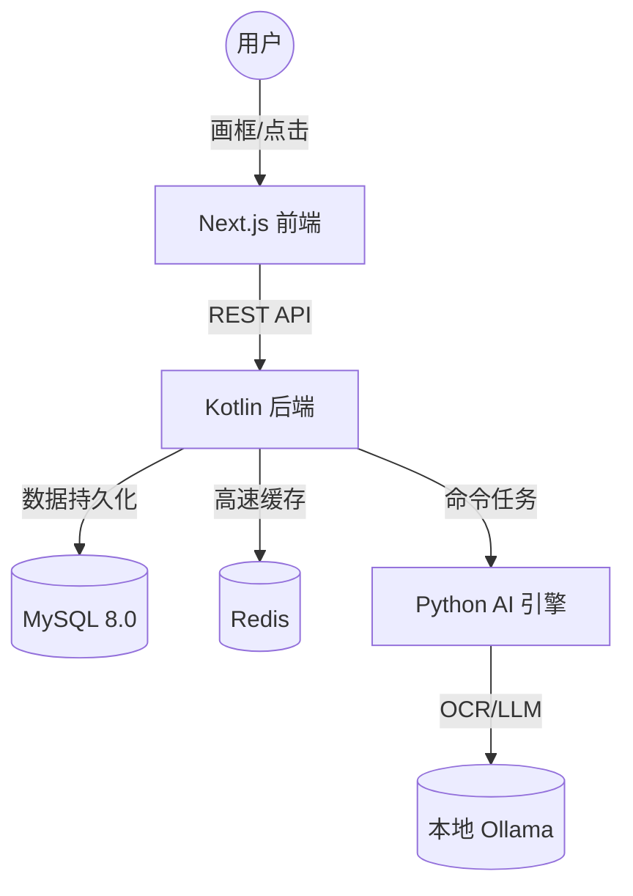

# Storybook 智能阅读系统：技术架构与实战手册

这是一份专为初学者设计的全栈开发蓝图。通过这份文档，你可以理解代码是如何从一个“框框”变成数据库里的一条记录，最后变成 AI 的播客。

## 1. 核心架构：一图胜千言



## 2. 目录结构设计 (Monorepo)

```text
stroybook-v2/
├── frontend/           # 界面 (TS + Next.js)
├── backend-kotlin/     # 业务大脑 (Kotlin + Spring)
├── service-ai/         # Python (AI Logic)
├── dev-env/            # 基建配置
└── docs/               # 你的学习笔记 (当前位置)
```

## 3. 中英双语设计 (Bilingual Support)

为了打造完美的语言学习体验，我们在数据库底层就实现了全方位的双语支持：
- **框框内容**：识别出的英文原文 (`text_en`) 与中文翻译 (`text_zh`)。
- **AI 解读**：提供深度英文解析 (`ai_interpretation_en`) 和中文同步讲解 (`ai_interpretation_zh`)。
- **生词本**：单词的英文柯林斯释义 (`definition_en`) 和中文简明释义 (`definition_zh`)。

## 4. 实战流转演示
... (Content same as before)
